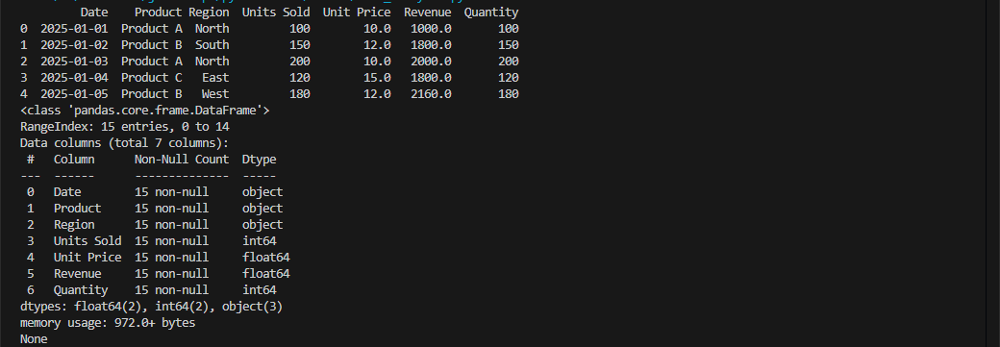
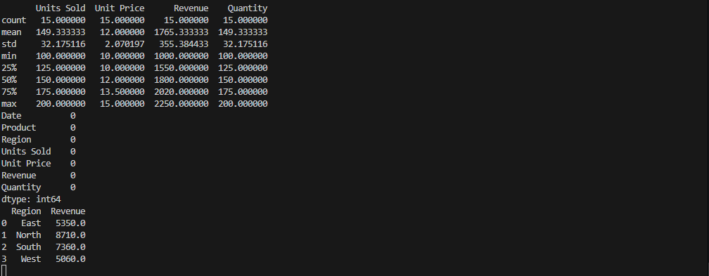
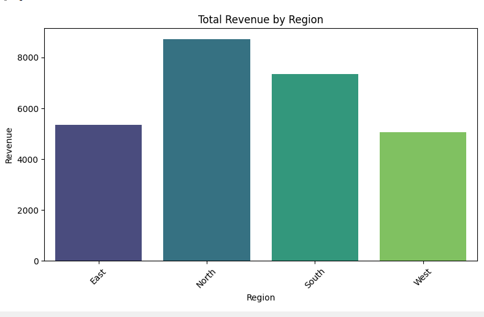
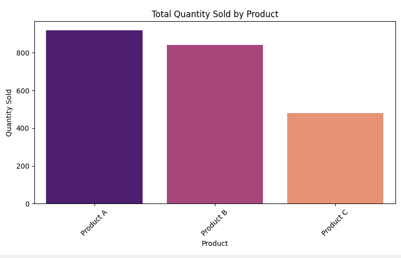
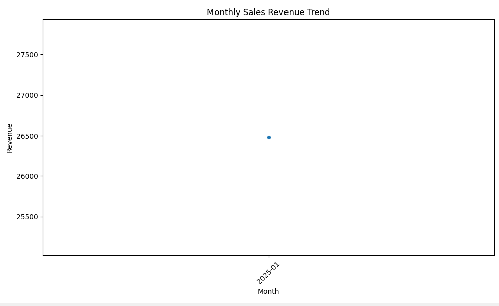

Task5-Data-Analysis
-------------------

📊 Sales Data Analysis
-------------------------

Analyze regional and product-based sales using Pandas, Matplotlib, and Seaborn.

---
📁 Dataset Format
------------------
CSV must include:

Date,Product,Region,Units Sold,Unit Price,Revenue,Quantity


---

🔍 Features
-------------
- Total revenue by region
- Total quantity sold by product
- Monthly sales trends
- Visualizations with bar and line charts

---

📸 Visual Output
------------------
🗺️ Total Revenue by Region






---

📦 Quantity Sold by Product



---

📈 Monthly Revenue Trend


---

🛠 Tech Stack
--------------
- Python
- Pandas
- Seaborn
- Matplotlib

---

▶️ Run It
------------
```bash
python data_analysis.py
